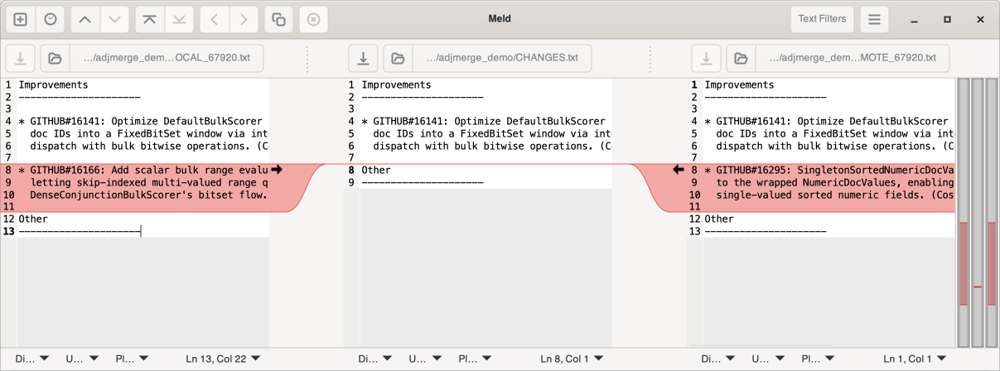
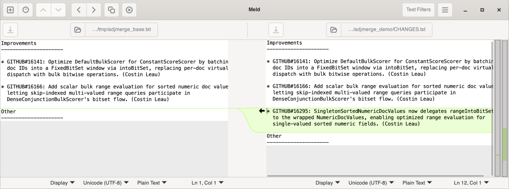

# adjmerge

A git merge driver that resolves adjacent non-overlapping changes Git falsely flags as conflicts.

## Why

Git treats adjacent changes as conflicts, even when the neighboring hunks don't actually touch.

For files that get modified a lot (e.g. changelog.md) across commits, even simple merges create false 
conflicts that require manual intervention. And occasionally [slip through with conflict markers intact](https://github.com/apache/lucene/commit/263c3a4765f#diff-be8459728adce212557bc19afbe0a8b91c788a49b1379323af40e3ba3ec4e479).

adjmerge uses the reconciliation logic from SVN's diff3.c, which treats adjacent hunks as separate edit regions rather than a single conflict. Thus changes that do not overlap, merge independently.

adjmerge can run as a Git merge driver during `git merge` with no workflow changes necessary or as `mergetool` for manual reviews.

## Installation

### 1. Download the appropriate binary for your platform

| Platform | Download |
|----------|----------|
| Linux 64-bit | [`adjmerge-linux-x64`](https://github.com/costin/adjmerge/releases/download/0.1.0/adjmerge-linux-x64) |
| macOS Apple Silicon | [`adjmerge-macos-aarch64`](https://github.com/costin/adjmerge/releases/download/0.1.0/adjmerge-macos-aarch64) |
| macOS Intel | [`adjmerge-macos-x64`](https://github.com/costin/adjmerge/releases/download/0.1.0/download/adjmerge-macos-x64) |
| Windows 64-bit | [`adjmerge-x64.exe`](https://github.com/costin/adjmerge/releases/download/0.1.0/adjmerge-x64.exe) |
| Windows 32-bit | [`adjmerge-x86.exe`](https://github.com/costin/adjmerge/releases/download/0.1.0/adjmerge-x86.exe) |

You might want to rename the binary to adjmerge after download.

#### From crates.io

```bash
cargo install adjmerge
```

### 2. Install the binary

**macOS/Linux**: Make it executable (`chmod +x adjmerge-*`) and move it to `~/.local/bin`.

On macOS, if Gatekeeper blocks the binary:

```bash
xattr -d com.apple.quarantine /usr/local/bin/adjmerge
```

**Windows**: Place the `.exe` in a directory on your `PATH` (e.g., `C:\dev\tools\`).

### 3. Verify installation

```
adjmerge --version
```

### 4. Configure Git to use adjmerge

#### Automatic merge driver (recommended)

First, configure adjmerge as a merge driver in Git:

```bash
git config --global merge.adjmerge.name "Adjacent-change merge driver"
git config --global merge.adjmerge.driver "adjmerge %O %A %B %A"
git config --global merge.adjmerge.recursive binary
```

This will create the following section in your global `~/.gitconfig`:

```ini
[merge "adjmerge"]
    name = Adjacent-change merge driver
    driver = adjmerge %O %A %B %A
    recursive = binary
```

The driver takes base (`%O`), local (`%A`), and remote (`%B`). It writes the merged result back to local (`%A`). Exit 0 indicates a clean merge, exit 1 means conflicts remain or auto-resolved output waiting for review (see Conservative mode below).

Next, have Git call adjmerge whenever it detects a conflict.
You can start by enabling on contentious files first:

```bash
# For Markdown files only
echo "*.md merge=adjmerge" >> .gitattributes

# For CHANGES.txt only, an author favourite
echo "CHANGES.txt merge=adjmerge" >> .gitattributes

# For all text files in docs
echo "docs/*.txt merge=adjmerge" >> .gitattributes
```

#### Conservative mode (default)

By default, adjmerge returns 1 even on successful auto-resolution so Git flags the file for review. The merged results can be verified and if acceptable the file staged.

#### Auto mode

To automate and skip the review after merging succeeds, pass `--auto` which will return 0 in case of no conflicts:

```bash
git config --global merge.adjmerge.driver "adjmerge --auto %O %A %B %A"
```

which will update the ~/.gitconfig accordingly:

```ini
[merge "adjmerge"]
    driver = adjmerge --auto %O %A %B %A
    ...
```

#### Manual merging as mergetool

One can configure adjmerge to be invoked explicitly through `git mergetool`.

```bash
# Add --auto for automatic mode
git config --global mergetool.adjmerge.cmd 'adjmerge "$BASE" "$LOCAL" "$REMOTE" "$MERGED"'
# Have Git trust the exit codes
git config --global mergetool.adjmerge.trustExitCode true
# Disable the "hit enter to continue" prompt (optional)
git config --global mergetool.adjmerge.prompt false
```

which adds the following section in your global git configuration:

```ini
[mergetool "adjmerge"]
    cmd = adjmerge "$BASE" "$LOCAL" "$REMOTE" "$MERGED"
    trustExitCode = true
    prompt = false
```

## Options

```bash
adjmerge [--auto] [--style diff3|zdiff3] <base> <local> <remote> <output>
```

| Flag | Effect |
|------|--------|
| `--auto` | Exit 0 on auto-resolved merges (skip review) |
| `--style zdiff3` | Strip common prefix/suffix from conflict markers |

## Exit codes

| Code | Meaning |
|------|---------|
| 0 | Clean merge or auto-resolved (with `--auto`) |
| 1 | Conflicts remain, or auto-resolved without `--auto` |
| 2 | Error (I/O failure, non-UTF-8 input) |

## Example

Two branches each add a CHANGES.txt entry after the same anchor line.
Without adjmerge, Git blocks the merge due to conflicts. 
With adjmerge, both entries appear in order and the merge resolves cleanly.

**Without adjmerge:**

```bash
$ git merge fix/singleton-docvalues
Auto-merging CHANGES.txt
CONFLICT (content): Merge conflict in CHANGES.txt
Automatic merge failed; fix conflicts and then commit the result.
```

```bash
<<<<<<< HEAD
* GITHUB#16166: Add scalar bulk range evaluation for sorted numeric doc values,
  letting skip-indexed multi-valued range queries participate in
  DenseConjunctionBulkScorer's bitset flow. (Costin Leau)
=======
* GITHUB#16295: SingletonSortedNumericDocValues now delegates rangeIntoBitSet
  to the wrapped NumericDocValues, enabling optimized range evaluation for
  single-valued sorted numeric fields. (Costin Leau)
>>>>>>> fix/singleton-docvalues
```



**With adjmerge:**

```bash
$ git merge fix/singleton-docvalues
Auto-merging CHANGES.txt
Merge made by the 'ort' strategy.
 CHANGES.txt | 4 ++++
 1 file changed, 4 insertions(+)
```

Both entries preserved, without conflict:

```
* GITHUB#16141: Optimize DefaultBulkScorer for ConstantScoreScorer by batching
  doc IDs into a FixedBitSet window via intoBitSet, replacing per-doc virtual
  dispatch with bulk bitwise operations. (Costin Leau)

* GITHUB#16166: Add scalar bulk range evaluation for sorted numeric doc values,
  letting skip-indexed multi-valued range queries participate in
  DenseConjunctionBulkScorer's bitset flow. (Costin Leau)

* GITHUB#16295: SingletonSortedNumericDocValues now delegates rangeIntoBitSet
  to the wrapped NumericDocValues, enabling optimized range evaluation for
  single-valued sorted numeric fields. (Costin Leau)
```



## Limitations

- Only handles adjacent non-overlapping changes. Overlapping changes still conflict.
- Currently requires UTF-8 input; non-UTF-8 files will error (exit 2).
- The `--style` option only affects conflict marker output, not resolution logic.

## License

Apache-2.0
